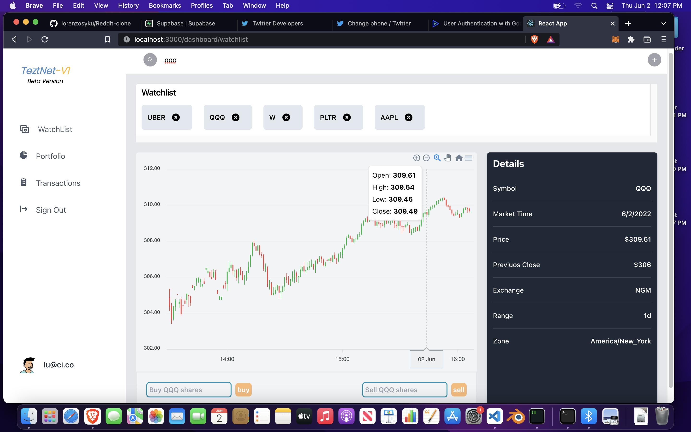

## Preview
 
 

## Trading App Clone

This is my attempt at coding a trading app that trades stocks with fake money, the data is pulled from Yahoo Finance API. The graphs I used are all from ApexCharts. The top one is candlestick chart where the latest stock price is displayed, the pie chart shows the value of each stock and your cash position in your portfolio and the line chart shows the total value of your portfolio at the first render(still working on that)

## Built With

- [ReactJS](https://reactjs.org/) - The Javascript Framework
  for Production.
- [TailwindCSS 3](https://tailwindcss.com/) - Rapidly build modern websites without ever leaving your HTML.
- [DiceBear Avatars](https://avatars.dicebear.com/) - JavaScript React library that generates custom, SVG-based avatars from any username and color palette.
- [React Hot Toast](https://react-hot-toast.com/) - Smoking hot React notifications.
- [ApexCharts](https://apexcharts.com/) - ApexCharts is a modern charting library that helps developers to create beautiful and interactive visualizations for web pages.
- [Firebase](https://firebase.google.com/) - Firebase is an app development platform that helps you build and grow apps and games users love. Backed by Google and trusted by millions of businesses around the world.